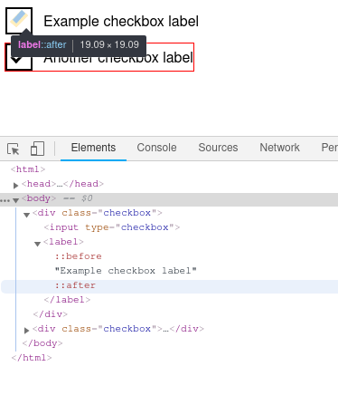

When developing the new Hive IT website, we hit on the infamous problem of having consistent checkboxes across browsers and devices. To do this, we decided to emulate GDS checkboxes. In this article, we'll start with a basic input checkbox and label, and then with CSS move towards a working, accessible, consistently-styled checkbox.

GDS's approach to checkboxes is this:
- Make the actual checkbox input opaque.
- Draw a border directly over the top of checkbox input.
- Draw a smaller box inside that border, then make it look like a check mark by rotating it 45 degrees and then only drawing two sides.
- Only display the smaller box if the real, hidden checkbox input is checked.

We started with this setup.

LINK TO checkbox-01

The first step is to hide the actual input checkbox, and then draw a box that will sit directly on top of the hidden input. To get the positioning correct, we set the containing div as `position: relative;` and all the child elements as `position: absolute;`. This does course the label text to move to the top left -- a problem we'll fix later. We add the box in the CSS using `::before` so that the HTML remains uncluttered.

LINK TO checkbox-02

At this point, it isn't possible to click the input, and even if you could, there would be visual indication that it has been checked.

The second step is to create a tick, to visually indicate to the user whether the the input is checked or not. This done by creating a box with `::after`, rotating it 45 degrees, positioning and sizing it, and then only drawing two sides so it appears like a tick.

LINK TO checkbox-03

Now we want to want the ability to check the input checkbox, and only display our new tick if the input is checked. Making the input checkable is as easy as setting `z-index: 1;`, allowing the input to capture a click event. To make the tick appear, we first make it `opacity: 0;` by default. Then we check whether any input is checked, and if it is we swing across to the tick, the `label::after`, and set `opacity: 1;`.

LINK TO checkbox-04

At this point, we're practically done. All that is required is to resize the text and move it into the correct position. Equally, we want add `cursor: pointer`

LINK TO checkbox-05

And we're done, right? Wrong! We haven't considered accessibility.

The first problem is that if the checkbox holds the focus, there is no indication that it holds it, making it difficult for people who rely on the keyboard to navigate the page. This is simply solved by adding an outline to the label if the associated input has the focus.

The second problem is a user might try to click label in order to check the checkbox. To solve this, we need to use javascript to add an event listener on the checkbox labels.

LINK TO checkbox-final

And then our work is done. 

